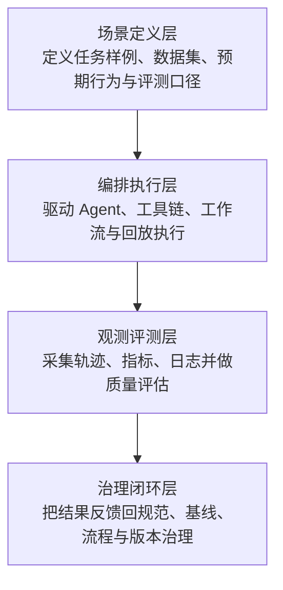

# 技术探索研究：Agent Harness Engineering

**成文时间**: 2026-04-17 15:52
**对比技术**: Cursor

---

## 摘要

面向智能体的工程学科：在模型之外构建编排、评测、观测与治理，使工具调用与多步任务可复现、可度量；勿与 Harness.io 混淆。

## 1. 研究范围与证据基础

本报告综合使用 6 个可信来源，覆盖 官方博客/工程文章、官方文档、标准/规范，可信级别涉及 A、B。

## 2. 研究对象与基础资料

**官方文档**: [https://harness-engineering.ai/blog/what-is-harness-engineering/](https://harness-engineering.ai/blog/what-is-harness-engineering/)

---

## 3. 可信来源汇总

| 来源 | 类型 | 可信级别 | 主要贡献 |
|------|------|----------|----------|
| 官方文档 | 官方文档 | A | 定义、能力边界与基础用法 |
| OpenAI Codex Engineering Article | 官方博客/工程文章 | B | 工程实践案例与运行时约束 |
| Anthropic Agentic Systems | 官方文档 | B | Agent harness 相关控制与工具调用背景 |
| 官方文档 (cursor.com) | 官方文档 | A | 定义、能力边界与使用方式 |
| 标准/规范 (thedocs.io) | 标准/规范 | A | 对象模型、协议约束与兼容边界 |
| 官方文档 (platform.openai.com) | 官方文档 | A | 定义、能力边界与使用方式 |

### 3.1 交叉验证说明

- 官方文档用于抽取定义、术语边界与基础能力。
- 标准/规范用于校正协议约束、对象模型与兼容边界。
- 论文或工程文章用于补充设计动机、实验现象与落地案例。

---

## 4. 语义标签归纳

| Tag | 说明 |
|-----|------|
| API | 应用程序接口 |
| Agent 框架 | Agent 开发框架 |
| CLI | 命令行接口 |
| 协议 | 标准化通信协议 |
| 多步任务 | 多步骤任务处理 |
| 工具调用 | 调用外部工具/服务 |
| 智能体 | AI 智能体 |
| 标准化 | 统一接口规范 |
| 测试框架 | 测试工具框架 |
| 自动化 | 自动化执行 |
| 验证 | 质量验证 |

---

## 5. 技术架构分析

**Draw.io 源文件**: `/Users/luckincoffee/Documents/code/star/skillsOfYao/learning/tech-explorer/output/reports/tech_explorer_Agent_Harness_Engineering_20260417_155202.drawio`

页签说明：`Agent Harness Engineering-架构` 为目标技术页，`架构并列对比` 为横向对照页，`四平面对比矩阵` 为控制 / 数据 / 执行 / 治理四平面矩阵。

### 5.1 架构视角

- 架构类型：验证治理驱动逻辑分层
- 逻辑分层：场景定义层 -> 编排执行层 -> 观测评测层 -> 治理闭环层
- 物理落位：场景 / 数据集 -> Harness 运行时 -> Agent / 工具链 -> 指标 / 评测 / 治理
- 核心控制点：评测口径与执行编排
- 集成边界：Agent 运行时、工具链、观测系统、评测基座
- 架构说明：更关注可复现、可度量、可治理，而不是单独定义协议或模型本体

### 5.2 架构图



### 5.3 逻辑分层明细

| 层级 | 分层名称 | 主要职责 |
|------|----------|----------|
| 1 | 场景定义层 | 定义任务样例、数据集、预期行为与评测口径 |
| 2 | 编排执行层 | 驱动 Agent、工具链、工作流与回放执行 |
| 3 | 观测评测层 | 采集轨迹、指标、日志并做质量评估 |
| 4 | 治理闭环层 | 把结果反馈回规范、基线、流程与版本治理 |

---

## 6. 对比分析

### 6.2 架构并列图示

该图示采用与 `drawio` 页签 `架构并列对比` 一致的统一分层矩阵结构：纵向固定公共分层，横向并列各技术，通过覆盖深度与必要说明展示场景和实现差异。

```text
统一分层           | Agent Harness E… | Cursor          
----------------------------------------------------
宿主接入层          | [  ]     | [##]    
控制编排层          | [##]     | [==]    
协议集成层          | [==]     | [==]    
执行运行层          | [==]     | [==]    
数据上下文层         | [==]     | [==]    
治理评测层          | [##]     | [  ]    

图示说明：
1. 行表示统一分层，列表示对比技术。
2. `[##] / [==] / [  ]` 分别表示强覆盖、中覆盖、弱覆盖。
3. 该图只呈现层次跨度与重心分布，具体说明见下方技术说明与 4.3、4.5。

技术说明：
```

- `Agent Harness Engineering`：跨度 `控制编排层 -> 治理评测层`；主导层 `控制编排层、治理评测层`；典型场景 `评测治理基座`；差异标记 `验证治理主导`。
- `Cursor`：跨度 `宿主接入层 -> 数据上下文层`；主导层 `宿主接入层`；典型场景 `开发工作台增强`；差异标记 `工作台集成主导`。

### 6.3 统一分层覆盖矩阵

说明：`强 / 中 / 弱` 分别表示该技术在对应统一层中的覆盖强度、控制深度或能力主导程度。

| 统一分层 | Agent Harness Engineering | Cursor |
|------|------|------|
| 宿主接入层 | 弱 / 评测治理基座 | 强 / 开发工作台增强 |
| 控制编排层 | 强 / 评测口径与执行编排 | 中 / 开发者工作流与 IDE 内嵌体验 |
| 协议集成层 | 中 / Agent 运行时、工具链、观测系统、评测基座 | 中 / 编辑器能力、本地终端、代码库、外部工具 |
| 执行运行层 | 中 / 编排执行层：驱动 Agent、工具链、工作流与回放执行 | 中 / 工具执行层：连接终端、代码搜索、诊断与外部能力 |
| 数据上下文层 | 中 / 场景定义层：定义任务样例、数据集、预期行为与评测口径 | 中 / 工作区同步层：管理文件状态、上下文与项目协同信息 |
| 治理评测层 | 强 / Agent 运行时、工具链、观测系统、评测基座 | 弱 / 编辑器能力、本地终端、代码库、外部工具 |

### 6.4 分层与控制点对比

| 技术 | 实现逻辑 / 物理分层 | 主要涉及层 | 主要差异标记 |
|------|---------------------|------------|--------------|
| Agent Harness Engineering | 场景定义层 -> 编排执行层 -> 观测评测层 -> 治理闭环层 | 评测口径与执行编排 | 基准：验证治理主导 |
| Cursor | 编辑交互层 -> 智能助手层 -> 工具执行层 -> 工作区同步层 | 开发者工作流与 IDE 内嵌体验 | 本技术偏「验证治理主导」，对比技术偏「工作台集成主导」。 |

### 6.5 四平面对比矩阵

| 技术 | 控制面 | 数据面 | 执行面 | 治理面 |
|------|--------|--------|--------|--------|
| Agent Harness Engineering | 评测口径与执行编排 | 场景定义层：定义任务样例、数据集、预期行为与评测口径 | 编排执行层：驱动 Agent、工具链、工作流与回放执行 | Agent 运行时、工具链、观测系统、评测基座 |
| Cursor | 开发者工作流与 IDE 内嵌体验 | 工作区同步层：管理文件状态、上下文与项目协同信息 | 工具执行层：连接终端、代码搜索、诊断与外部能力 | 编辑器能力、本地终端、代码库、外部工具 |

### 6.6 差异讨论

- 相较于 Cursor，`Agent Harness Engineering` 更强调「验证治理主导」，而 `Cursor` 更偏向「工作台集成主导」，二者的核心分歧集中在 `评测口径与执行编排` 与 `开发者工作流与 IDE 内嵌体验` 两类控制点。

---

## 7. 参考资料

- [官方文档](https://harness-engineering.ai/blog/what-is-harness-engineering/)
