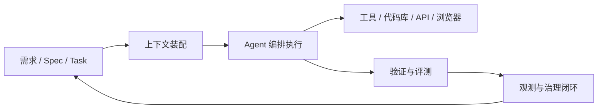

# 技术探索研究：Agent Harness Engineering 的应用

**成文时间**: 2026-04-17 17:15
**对比技术**: Cursor, SDD（Spec-Driven Development）

---

## 摘要

`Agent Harness Engineering` 不是单一产品，而是一套围绕智能体构建“可复现、可验证、可治理”执行系统的工程方法。它关注的核心不在模型本身，而在模型之外的 `instructions / context / tools / orchestration / verification / observability / guardrails`。若把智能体看成“会做事的引擎”，那么 harness 就是把这台引擎接入真实工程系统的底盘。

结合当前资料，可以把三者关系概括为：`Harness Engineering` 解决“智能体如何稳定运行”，`Cursor` 解决“开发者如何高效使用编码智能体”，`SDD` 解决“在智能体开始编码前，需求与约束如何被明确表达”。因此三者不是替代关系，而是分别位于运行治理层、开发工作台层、需求规格层的互补组合。

---

## 1. 研究范围与证据基础

本报告重点回答 4 个问题：

1. `Agent Harness Engineering` 在实际工程里主要用来解决什么问题。
2. 它适合哪些使用场景，典型落地形态是什么。
3. 它与 `Cursor` 的关系是“包含 / 依赖 / 并列 / 边界”中的哪一种。
4. 它与 `SDD` 的关系是“方法论协同”还是“功能重叠”。

资料来源以官方文档与官方工程文章为主，补充公开方法论材料：

- `harness-engineering.ai` 关于 `What is Harness Engineering` 与 `Agent Harness` 的公开文章
- `Cursor` 官方文档中关于 `agent harness`、工作流、上下文管理的说明
- `specdriven.ai` 对 `Spec-Driven Development` 的方法论定义
- 公开工程案例与总结性资料，用于补足“应用场景 / 运行边界 / 失败模式”

---

## 2. 研究对象与基础资料

**研究对象**: Agent Harness Engineering  
**定位**: 面向智能体系统的工程治理与运行体系  
**当前关注点**: 应用场景、示例，以及与 `Cursor`、`SDD` 的结合方式与边界

**核心参考链接**

- Harness Engineering 介绍: [https://harness-engineering.ai/blog/what-is-harness-engineering/](https://harness-engineering.ai/blog/what-is-harness-engineering/)
- Agent Harness Guide: [https://harness-engineering.ai/blog/agent-harness-complete-guide/](https://harness-engineering.ai/blog/agent-harness-complete-guide/)
- Cursor Agent Workflows: [https://cursor.com/docs/cookbook/agent-workflows](https://cursor.com/docs/cookbook/agent-workflows)
- Spec-Driven Development: [https://specdriven.ai/](https://specdriven.ai/)

---

## 3. 可信来源汇总

| 来源 | 类型 | 可信级别 | 主要贡献 |
|------|------|----------|----------|
| harness-engineering.ai `What Is Harness Engineering` | 官方文档/工程文章 | A | 定义 harness engineering 的对象、边界与价值 |
| harness-engineering.ai `Agent Harness Complete Guide` | 官方文档/工程文章 | A | 补充 agent harness 的组成与典型失败案例 |
| Cursor `Working with agents` | 官方文档 | A | 明确 Cursor 将 harness 表述为 `Instructions + Tools + Model` |
| specdriven.ai | 方法论站点 | B | 定义 SDD 的六阶段流程与“spec 作为单一事实源” |
| 公开工程综述资料 | 工程总结 | B | 补充应用场景、产品形态和组合方式 |

### 3.1 交叉验证说明

- `Harness Engineering` 的定义优先采用其官方站点表述。
- `Cursor` 的能力边界优先采用官方文档，不把第三方解读当作产品事实。
- `SDD` 这里按 `Spec-Driven Development` 理解，视为方法论，而非某个固定厂商产品。

---

## 4. 语义标签归纳

| Tag | 说明 |
|-----|------|
| 智能体 | 面向可规划、可执行的 Agent 系统 |
| 多步任务 | 关注多轮推理、工具调用与任务闭环 |
| 工具调用 | 连接终端、代码库、API、浏览器、数据系统 |
| 自动化 | 把重复任务交给智能体与编排系统 |
| 验证 | 用测试、回放、评分、门禁验证结果 |
| 测试框架 | 通过数据集、样例、基线评估 Agent |
| 标准化 | 用统一输入、输出、评测口径管理复杂系统 |
| 编程助手 | 与编码工作流结合，服务研发活动 |
| AI IDE | 以 IDE / 工作台形态承载 Agent 能力 |

---

## 5. 技术架构分析

### 5.1 架构视角

- 架构类型：验证治理驱动的逻辑分层
- 核心目标：把“智能体能做事”升级为“智能体能稳定做对事”
- 核心控制点：任务定义、上下文装配、工具授权、执行回放、结果验证、日志观测、失败处置
- 集成边界：上接需求 / 规格 / IDE / 产品入口，下接模型、工具、运行环境与观测系统
- 一句话说明：`Harness Engineering` 不是再造一个模型，而是在模型外搭建工程运行骨架

### 5.2 逻辑分层

| 层级 | 分层名称 | 主要职责 |
|------|----------|----------|
| 1 | 规格与任务定义层 | 定义目标、输入、约束、验收标准、样例集 |
| 2 | 上下文装配层 | 选择提示词、规则、检索结果、代码上下文、历史状态 |
| 3 | 编排执行层 | 调度模型、工具、子任务、回放流程与错误恢复 |
| 4 | 验证观测层 | 执行测试、评分、日志采集、轨迹分析、成本统计 |
| 5 | 治理闭环层 | 沉淀基线、门禁、规则、回归用例与版本策略 |

### 5.3 文字图示



### 5.4 四平面理解

| 平面 | 主要内容 |
|------|----------|
| 控制面 | 任务拆解、模型选择、工具授权、执行策略、重试策略 |
| 数据面 | Prompt、Spec、工作区、历史状态、检索内容、评测集 |
| 执行面 | 实际调用模型、Shell、编辑器、浏览器、API、测试系统 |
| 治理面 | 质量门禁、审计、成本控制、失败回放、可观测性、版本化 |

---

## 6. 应用场景与示例

### 6.1 场景总览

| 场景 | 为什么需要 Harness Engineering | 典型输出 |
|------|------------------------------|----------|
| 编码智能体开发 | 防止 Agent 直接改坏仓库或失控扩散 | PR、测试结果、回放记录、失败样本 |
| 客服 / 工单智能体 | 防止错误调用、重复重试、异常话术 | 路由结果、审计日志、策略回退 |
| 运维 / SRE 智能体 | 防止高风险命令误执行 | 执行审批、沙箱记录、变更审计 |
| 数据分析智能体 | 防止 SQL 越权、口径漂移、结果不可复现 | 查询轨迹、口径版本、结果校验 |
| 批量自动化流程 | 防止大规模任务中局部失败不可定位 | 样本集、批处理指标、失败聚类 |

### 6.2 示例 1：编码 Agent 的提交前治理

目标不是“让 Agent 会写代码”，而是“让 Agent 写出的代码可交付”。

常见实现方式：

1. 用 `Spec / Task` 定义改动范围与验收标准。
2. 给 Agent 分配允许访问的目录、工具和命令范围。
3. 让 Agent 在隔离环境中改代码、跑测试、收集 diff。
4. 对结果做自动验证：编译、单测、lint、安全扫描、快照比对。
5. 失败时保留执行轨迹与中间产物，便于回放和复盘。

输出结果通常不是“代码已生成”，而是：

- 哪些文件被改了
- 哪些检查通过 / 失败
- 哪些失败可自动修复
- 哪些需要人工接管

### 6.3 示例 2：客服 / 工单 Agent 的线上可靠性治理

智能体在线上处理用户请求时，最怕的不是“答得慢”，而是“错得像对的一样”。  
此时 harness 的重点从编码测试，转向：

- 工具白名单与权限边界
- 关键 API 调用次数限制
- 失败重试阈值
- 高风险动作二次确认
- 结果审计与人工回退

这类场景说明：`Harness Engineering` 不是只服务编码 Agent，而是服务所有需要“受控执行”的 Agent 系统。

### 6.4 示例 3：批量仓库改造 / 大规模迁移

例如统一升级 SDK、批量修复安全问题、跨仓库代码风格迁移。

这类任务的关键难点不是单次生成，而是：

- 如何把 100 个仓库拆成稳定批次
- 如何定义统一验收口径
- 如何在失败时精确回放到某个仓库、某个步骤
- 如何比较不同模型 / prompt / 工具策略的效果

这里 harness 更像“批处理控制塔”，而不是单次对话助手。

---

## 7. 与 Cursor、SDD 的对比分析

### 7.1 一句话定位

- `Harness Engineering`：智能体系统的运行与治理骨架
- `Cursor`：把编码 Agent 放进 IDE 工作台的产品形态
- `SDD`：在编码前明确意图、约束、验收标准的规格方法论

### 7.2 角色差异表

| 维度 | Agent Harness Engineering | Cursor | SDD |
|------|---------------------------|--------|-----|
| 本质 | 工程学科 / 运行治理体系 | 产品 / AI IDE / 编码工作台 | 方法论 / 规格驱动流程 |
| 解决问题 | Agent 如何稳定执行 | 开发者如何高效使用编码 Agent | 需求如何清晰表达给 Agent |
| 关注重心 | 编排、验证、观测、门禁、回放 | 编辑体验、上下文管理、工具调用、协作 | 规格、澄清、计划、任务拆分、验收标准 |
| 典型产物 | 运行时、门禁、日志、评测基线 | 代码改动、对话、IDE 内工作流 | `constitution/spec/plan/tasks` 等工件 |
| 失效风险 | 没有治理导致 Agent 失控或不可复现 | 没有上下文和约束导致范围漂移 | 规格不足导致生成偏题与返工 |

### 7.3 四平面对比矩阵

| 对象 | 控制面 | 数据面 | 执行面 | 治理面 |
|------|--------|--------|--------|--------|
| Harness Engineering | 强：定义任务、授权、门禁、回放 | 强：管理上下文、数据集、轨迹、基线 | 强：调度模型与工具执行 | 强：审计、评分、成本、回归、失败恢复 |
| Cursor | 中：通过规则、模式、提示管理任务 | 中：依赖工作区、会话上下文、索引 | 强：编辑文件、搜索代码、跑终端、调浏览器 | 弱到中：有工作流约束，但不是完整治理平台 |
| SDD | 中：通过 spec / plan / tasks 约束实现路径 | 强：把规格作为事实源 | 弱：自身不负责运行 Agent | 中：靠验收标准和评审门控，但不直接执行观测 |

### 7.4 关系判断

#### 1）Harness Engineering 与 Cursor

`Cursor` 本身就是一种“编码 Agent harness 的产品化形态”。  
它的官方文档明确把 harness 拆为：

- `Instructions`
- `Tools`
- `Model`

但 `Cursor` 更偏向“开发者前台工作台”，而不是“全生命周期治理后端”。

所以两者关系不是谁包含谁，而是：

- `Cursor` 是 harness 思想在编码场景中的一个产品实例
- `Harness Engineering` 是更上位的工程视角，范围大于 Cursor

换句话说：不是所有 harness 都是 Cursor，但 Cursor 可以看作一种 harness product。

#### 2）Harness Engineering 与 SDD

两者是上下游关系，不是替代关系。

`SDD` 主要解决“做什么、为什么这样做、验收标准是什么”；  
`Harness Engineering` 主要解决“按这些要求执行时，如何让系统稳定、可控、可验证”。

因此：

- `SDD` 更像输入工件层
- `Harness Engineering` 更像执行治理层

没有 `SDD`，harness 可能在不清晰目标上高效执行；  
没有 harness，SDD 也可能只停留在文档层，无法保证实际运行质量。

---

## 8. 结合方式与边界

### 8.1 推荐结合方式

```text
SDD 产出 spec / plan / tasks
        ↓
Cursor 作为开发工作台执行具体实现
        ↓
Harness Engineering 提供回放、验证、观测、门禁
        ↓
人工评审与上线决策
```

### 8.2 推荐组合 1：单功能研发

适合中小型功能开发。

- `SDD`：先写 `spec`、澄清边界、拆分任务
- `Cursor`：按任务粒度逐步实现
- `Harness`：在每步后跑测试、对比 diff、记录失败样本

特点：节奏轻、反馈快、对个人或小团队友好。

### 8.3 推荐组合 2：高风险改动

适合支付、权限、数据迁移、批量重构。

- `SDD`：把约束和禁止项写死
- `Cursor`：承担交互式开发和局部修复
- `Harness`：提供沙箱、审批、回放、审计、回归集

特点：前置规格 + 强治理，优先降低事故风险。

### 8.4 推荐组合 3：平台化 Agent 研发

适合内部要打造自己的编码 Agent、运营 Agent、分析 Agent 平台。

- `SDD`：统一各类 Agent 的任务规格模板
- `Cursor`：供研发人员快速试验 prompt、规则和工具组合
- `Harness`：沉淀成平台级运行控制层

特点：最能体现 harness engineering 的长期价值。

### 8.5 明确边界

| 问题 | 更适合谁负责 | 原因 |
|------|--------------|------|
| 需求是否清晰、验收标准是否明确 | SDD | 这是规格层问题 |
| 开发者如何高效查看代码、修改文件、跑命令 | Cursor | 这是工作台体验问题 |
| Agent 是否可复现、可回放、可审计、可门禁 | Harness Engineering | 这是运行治理问题 |
| 模型本身推理能力是否足够 | 模型 / 训练体系 | 这不属于 harness 主体范围 |

### 8.6 不适合过度上 Harness 的场景

- 一次性脚本
- 低风险、低复杂度的小玩具项目
- 只有单步调用、几乎没有工具执行与状态管理的场景

这类场景里，直接用 `Cursor` 或轻量 Agent 即可，过强治理反而增加成本。

---

## 9. 结论

`Agent Harness Engineering` 的价值，不在于让 Agent “更聪明”，而在于让 Agent “更像工程系统”。  
如果说 `Cursor` 让开发者更容易使用编码 Agent，那么 `Harness Engineering` 让团队更敢把 Agent 放进真实流程。  
而 `SDD` 则负责在执行之前，把人类意图变成机器可消费的明确规格。

因此一个实用判断是：

- 你在解决“怎么把需求说清楚”时，用 `SDD`
- 你在解决“怎么把 Agent 放进开发流程”时，用 `Cursor`
- 你在解决“怎么让 Agent 稳定上线、持续验证、长期治理”时，用 `Harness Engineering`

三者最好的关系不是二选一，而是分层协同。

---

## 10. 参考资料

- [What Is Harness Engineering?](https://harness-engineering.ai/blog/what-is-harness-engineering/)
- [The Complete Guide to Agent Harness](https://harness-engineering.ai/blog/agent-harness-complete-guide/)
- [Cursor: Working with agents](https://cursor.com/docs/cookbook/agent-workflows)
- [Spec-Driven Development](https://specdriven.ai/)

---
*Generated by tech-explorer skill*
