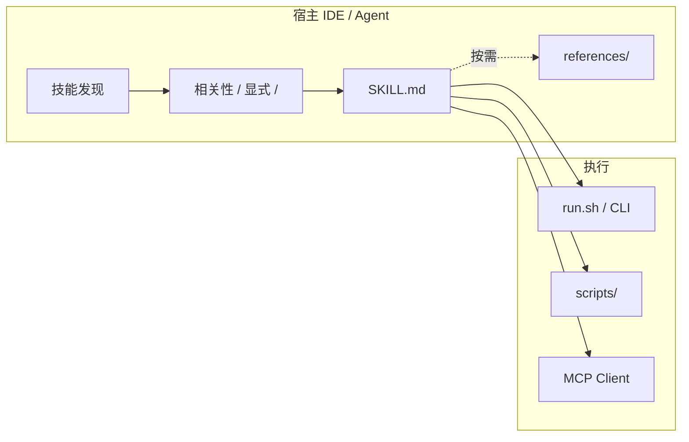

# 🔍 新技术探索：Agent Skills + CLI 组合方案

**探索时间**: 2026-04-20  
**对比技术**: MCP（Model Context Protocol）

---

## 📖 技术介绍

**Agent Skills** 是以 `SKILL.md`（YAML 头信息 + 正文）为核心的开放标准能力包：把领域流程、约束与可执行脚本打包，供 IDE/Agent 在启动时发现，并按相关性自动或显式（`/` 命令）载入上下文。**CLI** 在此语境下通常指与技能包同仓的 `run.sh`、Python/Node 入口等：用编号菜单与 `--yes` 跳过确认，把「结构化提问—多源抓取—写报告」等流程做成可重复、可自动化的壳层。二者组合时，**Skill 负责教模型怎么做事、何时加载哪些参考材料**；**CLI 负责在无对话或 CI 场景下复现同一套流程**。官方将 Skills 与 MCP 开发结合：用技能指导 MCP Server 的部署模型与工具设计，说明两条线正在收敛为「指令包 + 可调用能力」的分工。

**官方文档**: [Cursor Agent Skills](https://cursor.com/docs/context/skills) · [MCP 简介](https://modelcontextprotocol.io/introduction) · [MCP：Build with Agent Skills](https://modelcontextprotocol.io/docs/develop/build-with-agent-skills) · [开放标准站点](https://agentskills.io/)

**GitHub**: [modelcontextprotocol](https://github.com/modelcontextprotocol) · [mcp-server-dev 技能插件](https://github.com/anthropics/claude-plugins-official/tree/main/plugins/mcp-server-dev)

---

## 🏷️ 技术 Tags

| Tag | 说明 |
|-----|------|
| 智能体 | 由 Agent 解析技能描述并决定是否载入 |
| 工作流 | SKILL.md 内嵌分步流程与闸门 |
| CLI | 脚本入口、参数约定、非交互模式 |
| 工具调用 | 技能可引用 `scripts/`，由宿主执行 |
| 标准化 | agentskills.io 与多 IDE 目录约定 |
| 上下文管理 | 主文档精简、`references/` 渐进加载 |
| 协议 | 与 MCP 在「对外能力面」上互补而非替代 |

---

## 🏗️ 技术架构

### 架构视角

- **架构类型**: 混合视角（宿主内逻辑分层 + 可选本地/远程进程）
- **逻辑分层**: 发现层 → 路由层（相关性/显式调用）→ 指令与资产层 → 执行适配层（终端/MCP/内置工具）
- **物理落位**: 仓库内 `.cursor/skills/` 等目录；CLI 为同机子进程；MCP Server 可为本机 stdio、远程 HTTP 或 MCP Bundle
- **核心控制点**: 宿主何时注入技能全文 vs 仅注入摘要；CLI 的 `--yes` 与菜单分支
- **集成边界**: 文件系统、Shell、以及通过 MCP 暴露的工具/资源
- **架构说明**: Skill 偏「教与编排」，CLI 偏「可重复的进程边界」，MCP 偏「跨宿主的标准工具/资源协议」

### 逻辑分层明细

| 层级 | 分层名称 | 主要职责 |
|------|----------|----------|
| L1 | 发现与注册 | 扫描技能目录，暴露给 Agent 或 `/` 列表 |
| L2 | 触发与闸门 | 自动相关性 vs `disable-model-invocation` 仅手动 |
| L3 | 指令面 | `SKILL.md` 正文 + `references/` 按需读取 |
| L4 | 执行面 | `scripts/`、CLI、`run.sh`、宿主 Terminal |
| L5 | 治理面 | 许可、兼容声明、审计（谁在何时跑了哪条脚本） |



---

## 🔄 与已有技术对比

### 匹配到的已有知识

| 技术 | 匹配 Tags | 匹配度（示意） |
|------|----------|----------------|
| MCP | 工具调用、标准化、API、AI 集成 | 约 50%–60%（交集偏「工具与集成」，差在「自然语言工作流闸门」） |

### 相同点

| 维度 | Skill + CLI | MCP |
|------|-------------|-----|
| 目标 | 扩展 Agent 可完成的动作空间 | 标准化连接外部系统与工具 |
| 可执行性 | 脚本、命令行 | tools、可选本地/远程服务 |
| 生态 | Cursor/Claude 等多宿主目录兼容 | 多客户端实现同一协议 |

### 区别点

| 维度 | Skill + CLI | MCP |
|------|-------------|-----|
| 抽象单位 | 指令包 + 可选脚本 | tools / resources / prompts 等协议对象 |
| 传输与发现 | 文件树、设置页展示 | 握手、能力列表、JSON-RPC 等 |
| 交互模型 | 模型读 Markdown 决策；CLI 用菜单 | 客户端按 schema 调工具 |
| 适用重心 | 团队流程、写作规范、脚手架对话 | 数据源与应用 API 的标准插座 |

### 架构对比

| 技术 | 实现逻辑 / 物理分层 | 主要涉及层 | 主要差异标记 |
|------|---------------------|------------|--------------|
| Skill + CLI | 宿主进程内上下文 + 本机子进程 | L1–L5 全覆盖，执行面可极轻 | **流程与文档优先** |
| MCP | 客户端 ↔ 服务进程（stdio/HTTP 等） | 协议、服务暴露、安全治理 | **协议与 RPC 优先** |

### 四平面（控制 / 数据 / 执行 / 治理）

| 平面 | Skill + CLI | MCP |
|------|-------------|-----|
| 控制面 | 头信息、`disable-model-invocation`、CLI 菜单分支 | capability 协商、工具注册 |
| 数据面 | `references/`、资产文件、报告输出目录 | resources、URI、二进制负载 |
| 执行面 | Shell/Python、`scripts/` | tool 调用、elicitation、Apps |
| 治理面 | 仓库 Code Review、技能供应链 | Server 权限、OAuth、审计 |

### 适用场景

| 场景 | 推荐技术 | 理由 |
|------|----------|------|
| 团队统一写报告/评审闸门 | Skill + CLI | Markdown 即规范，CLI 可无人值守 |
| 接公司 API、DB、SaaS | MCP | 稳定 schema 与多客户端复用 |
| 从 0 搭建 MCP Server | 二者组合 | 官方推荐用 mcp-server-dev **技能** 引导脚手架 |

---

## 📥 安装与分发方式对比

| 维度 | Skill（+ 可选 CLI） | MCP Server |
|------|---------------------|------------|
| 发现机制 | 宿主扫描固定目录下的文件夹（内含 `SKILL.md`） | 客户端读取 `mcp.json` / Marketplace 注册 / Extension API |
| 安装动作 | 复制目录、克隆仓库、或「远程规则」指向 GitHub | 一键安装、或配置命令行/URL、或企业侧程序化注册 |
| 运行形态 | 无独立长驻服务；脚本随 Agent/终端按需执行 | 常为子进程 **stdio** 或远程 **SSE / Streamable HTTP** |
| 身份与密钥 | 一般走仓库与本地环境；`compatibility` 可声明需求 | `env` / `envFile`、`${env:NAME}` 注入；远程常 **OAuth** |
| 多用户分发 | 每人拷贝技能目录或拉同一 Git 子路径 | 远程部署一处，多客户端连同一 URL；stdio 偏单机 |
| 升级方式 | `git pull` 或替换技能包目录 | 改 `mcp.json`、镜像版本、或 Marketplace 更新 |

### Skill 安装示例

**示例 A：项目内技能（最常见）**

将技能文件夹放到仓库内，例如：

`your-repo/.cursor/skills/tech-explorer/SKILL.md`

重启或打开项目后，Agent 在 **Settings → Rules → Agent Decides** 中可见；也可在对话用 `/` 搜索技能名。

**示例 B：用户级全局技能**

复制到 `~/.cursor/skills/<skill-name>/`（或 `~/.agents/skills/`，与 Cursor 文档中的兼容路径一致），所有打开的工作区都可被发现。

**示例 C：从 GitHub 安装（Cursor）**

**Settings → Rules → Project Rules → Add Rule → Remote Rule (Github)**，填入仓库 URL；适用于团队统一拉取只读技能源。

**示例 D：CLI 能力（同仓技能附带）**

技能包内若有 `run.sh`，安装即：**进入技能包根目录**，保证 `scripts/` 依赖已安装（如 `python3`），执行：

```bash
chmod +x run.sh
./run.sh "主题" --yes
```

CLI 不依赖 Cursor 发现机制；CI 中可直接调用同一入口。

### MCP 安装示例

**示例 E：Marketplace 一键（Cursor）**

在 [Cursor Marketplace](https://cursor.com/marketplace) 或 [cursor.directory](https://cursor.directory/) 找到插件，**Add to Cursor**；若服务端要 OAuth，按引导在宿主内完成授权。

**示例 F：本地 stdio（`mcp.json`）**

在项目 `.cursor/mcp.json`（或文档所述用户/工作区配置位置）中增加 stdio 条目，例如调用 `npx` 启动某官方包（`command` / `args` 以实际包为准）：

```json
{
  "mcpServers": {
    "example-stdio": {
      "type": "stdio",
      "command": "npx",
      "args": ["-y", "some-mcp-server-package"],
      "env": {
        "API_KEY": "${env:MY_API_KEY}"
      }
    }
  }
}
```

**示例 G：远程 Streamable HTTP + OAuth**

在 `mcp.json` 中配置 `url` 指向已部署的 MCP 端点；若服务商提供固定 Client ID（及可选 Secret），按 [Cursor MCP 文档](https://cursor.com/docs/context/mcp) 在对应条目增加 `auth`（含 `scopes` 等），并在服务商控制台登记 Cursor 使用的固定 redirect URL。

**示例 H：分发形态差异（与 Skill 对照）**

| 诉求 | 更顺手的路线 |
|------|----------------|
| 只把「写法与流程」同步到全组 | Skill 目录 + Git，或 Remote Rule |
| 要把「可调用的公司 API / DB」接到多个 IDE | MCP 远程部署 + OAuth |
| 必须读用户本机文件、起本地命令 | MCP **stdio** 或 **MCP Bundle（.mcpb）**；Skill 侧则常靠 `scripts/` + 用户本机环境 |

### 示例 I：Luckin 企业基线（`lucp-tool` + `lucp-update` 双技能 + 知识库）

**材料**（同一基础库、不同职责）：

| 技能 | 链接 |
|------|------|
| **`lucp-tool`**（日常 LUCP 能力：读写给 Agent） | [目录树 `.../general/lucp-tool`](http://git.lkcoffee.com/opensource/cursor_common/-/tree/feature-20260417-lucpskill-zqh/.cursor/skills/general/lucp-tool?ref_type=heads) |
| **`lucp-update`**（工具链 / 技能集更新） | [`SKILL.md` blob](http://git.lkcoffee.com/opensource/cursor_common/-/blob/feature-20260417-lucpskill-zqh/.cursor/skills/general/lucp-update/SKILL.md?ref_type=heads) |
| 联盟认证 | [乐享 · Luckin Coffee Union Auth](https://lexiangla.com/pages/9fc2fb7e5a254110a1d353c2624e1ae7?company_from=7d6d91e84cca11f0908e1af521f7359d) |
| 瑞幸 NPM（全局 CLI 包来源、registry） | [乐享说明页](https://lexiangla.com/pages/90ef24d20d5f4091a65fc2d607401dd2?company_from=7d6d91e84cca11f0908e1af521f7359d) |

**角色对照**

| 包 | 主要用途 |
|----|----------|
| **`lucp-tool`** | 业务向：查/改 LUCP 对象、与 Launch 等工作流交互；`SKILL.md` 约定用 **MCP 工具**、**CLI** 或二者择一（以仓库正文为准）。 |
| **`lucp-update`** | 元操作：拉齐 **团队 skills**、**全局 CLI（npm）**、**install 脚本** 等到指定版本；与「一对一 / 一对多」发布面相关逻辑写在技能内。 |

**共性（分发 · 授权 · 技能升级）**

| 侧面 | 做法 |
|------|------|
| **分发** | `cursor_common` 中 `.cursor/skills/general/<skill>/` 为单一事实源；业务仓 **submodule / 拷贝 / 固定 tag**。 |
| **授权** | 联盟账号与 token 规则以 **乐享 Union Auth** 为准；仓库不存密钥。 |
| **技能本身升级** | 在基础库切分支或合并后发版；业务侧 `git pull` / 更新子模块后重启 Cursor，使新 `SKILL.md` 生效。 |

---

#### 全流程示例 I-1：`lucp-tool`（安装 → 调用）

以下为与 **Cursor + 内网** 常见装法对齐的**示意步骤**；具体子命令、环境变量名、工具名以 [lucp-tool 目录内 `SKILL.md` / `reference/`](http://git.lkcoffee.com/opensource/cursor_common/-/tree/feature-20260417-lucpskill-zqh/.cursor/skills/general/lucp-tool?ref_type=heads) 为准。

**安装**

1. 从内网拉取 `cursor_common` 的约定分支（如 `feature-20260417-lucpskill-zqh`）或你司固定 tag。  
2. 将 **`lucp-tool` 整个文件夹** 放到 `your-repo/.cursor/skills/lucp-tool/`（或与 `SKILL.md` 中 `name` 一致的目录名）。可选：同步到 `~/.cursor/skills/lucp-tool/` 做用户级生效。  
3. 打开 [Union Auth](https://lexiangla.com/pages/9fc2fb7e5a254110a1d353c2624e1ae7?company_from=7d6d91e84cca11f0908e1af521f7359d) 完成联盟侧登录/授权，按页面说明拿到 **环境变量或配置文件** 落位方式（用户 shell、`.env`、或 CI secret）。  
4. 若技能要求 **全局 CLI**：按 [瑞幸 NPM](https://lexiangla.com/pages/90ef24d20d5f4091a65fc2d607401dd2?company_from=7d6d91e84cca11f0908e1af521f7359d) 配置 registry 后执行 `npm install -g <包名>`（包名与版本以 `lucp-tool` 文档为准）。  
5. 若技能要求 **LUCP MCP**：在 `.cursor/mcp.json` 增加 stdio/远程条目（与内部 MCP 发布方式一致），保证 Cursor **Available Tools** 中出现 LUCP 系列 tool。  
6. 重启 Cursor 或 **Reload Window**，在 **Settings → Rules → Agent Decides** 中确认 `lucp-tool` 已发现。

**调用**

1. 用户在 Agent 中描述 LUCP 任务（例如：「查某 Launch 状态」「按模板补发布说明」），或通过 `/` 显式选中 `lucp-tool`。  
2. Agent **先读** `SKILL.md`（及目录内 `references/`，若有），按其中顺序做 **前置检查**（登录、环境变量、`command -v` 等）。  
3. **执行面二选一（以技能为准）**：  
   - **MCP**：`call_mcp_tool` 调用 `lucp_*` 等工具（宿主已在 `mcp.json` 接入 LUCP MCP 时，与常见 `lucp_search_user`、`lucp_search_launch` 等工具同一通道）；  
   - **CLI**：在终端执行技能写明的命令（如 `lucp-tool ...` 或 `zeus-tool ...`，**以仓库为准**）。  
4. 将结构化结果写回对话或落盘到项目路径；失败时按 `SKILL.md` 错误处理节重试或引导用户打开乐享文档。

---

#### 全流程示例 I-2：`lucp-update`（安装 → 调用）

**安装（首次具备「更新技能」能力）**

1. 将 [`lucp-update` 技能目录](http://git.lkcoffee.com/opensource/cursor_common/-/blob/feature-20260417-lucpskill-zqh/.cursor/skills/general/lucp-update/SKILL.md?ref_type=heads) 同步到 `your-repo/.cursor/skills/lucp-update/`（或用户级 skills）。  
2. 同 **I-1** 完成 Union Auth 与（若需要）NPM registry，以便后续脚本/`npm` 能拉内网包。  
3. 重启 Cursor，确认 **Agent Decides** 中出现 `lucp-update`。

**调用（对工具链 / 多项目做升级）**

1. 用户明确「更新 lucp 工具 / 全组 skills / 当前项目 zeus-tool」等，或执行 `/lucp-update`。  
2. Agent 读 `lucp-update` 的 `SKILL.md`，按步骤执行：常见包括 **指定版本 `npm install -g`**、运行 **install 脚本并 `--project` 指定生效路径**、从 `cursor_common` **拉取或覆盖** `.cursor/skills` 子集。  
3. **验证**：按技能要求检查 CLI `--version`、或 spot-check `lucp-tool` 一次最小调用、或核对 MCP tool 列表。  
4. **升级闭环**：基础库合并后各业务仓 **pull / 更新 submodule**；需要全局包时再走一遍 `npm` 或 install 脚本。

**思想**：**`lucp-tool` 管「用事」，`lucp-update` 管「换代」**；身份与 registry 在乐享，行为在 Git 版本化的 `SKILL.md` 里锁死顺序。

### 示例 J：Feishu-Skill（Skill + `feishu-tool` CLI，参考 `reference/` 渐进加载）

**材料**：[feishu-skill 仓库](https://github.com/cso1z/Feishu-Skill/tree/main/feishu-skill) · [reference 目录](https://github.com/cso1z/Feishu-Skill/tree/main/feishu-skill/reference)（`document.md` / `task.md` / `member.md` / `cli.md`）。

| 侧面 | 做法（与仓库 `SKILL.md` 一致） |
|------|------------------------------|
| **形态** | **Skill 编排 + 全局 CLI**（`feishu-tool`）+ 底层 **`feishu-mcp` npm 包**；即用 Bash 调 CLI，而非在 IDE 里单独配一条 MCP Server（也可并行使用 MCP，此技能选择 CLI 统一参数 JSON） |
| **安装** | `npm install -g feishu-mcp@latest` 提供 `feishu-tool`；`feishu-tool --help` 失败则重装 |
| **配置** | `feishu-tool config` 检查 `FEISHU_APP_ID` / `FEISHU_APP_SECRET`；缺省则 `feishu-tool guide` |
| **授权** | `FEISHU_AUTH_TYPE=user` 时走 `feishu-tool auth` 与浏览器授权；技能内规定轮询与超时 |
| **升级** | **版本门槛**写死在流程里（如要求 `feishu-mcp` ≥ 0.3.1）；不满足则再次 `npm install -g feishu-mcp@latest`，并**从第一步重新验证** |
| **使用示例** | 调工具前 **先 Read 对应 `reference/<模块>.md`**，再 `feishu-tool <tool-name> '<json>'`；与 Cursor 标准 `SKILL.md` 相比，frontmatter 含 `version`、`allowed-tools`、`parameters`，偏 **Claude Code 系技能扩展** |

**思想**：**把「MCP 能力面」收成 CLI，Skill 只负责前置检查、读参考、拼 JSON 调用**；安装/升级 **跟 npm 全局包版本绑定**，技能文本与 `reference/` 同步迭代。

---

#### 全流程示例 J-1：Feishu-Skill（安装 → 调用）

**安装**

1. 将 [feishu-skill](https://github.com/cso1z/Feishu-Skill/tree/main/feishu-skill) 复制到 `your-repo/.cursor/skills/feishu-skill/`（目录名与 frontmatter `name: feishu-skill` 一致）。  
2. 执行 `npm install -g feishu-mcp@latest`。  
3. 终端运行 `feishu-tool --help`：失败则重复步骤 2；成功则继续。  
4. 按 `SKILL.md` 检查 **全局包版本**（如 ≥ 0.3.1）；不足则升级后**从步骤 3 重新验证**。  
5. `feishu-tool config`：若 `FEISHU_APP_ID` / `FEISHU_APP_SECRET` 未设置，执行 `feishu-tool guide` 按引导完成初始化后停止，直至配置就绪。  
6. 若 `FEISHU_AUTH_TYPE=user`：`feishu-tool auth`，按技能说明处理 `isValid` / 浏览器授权与轮询。  
7. 重启或 Reload Cursor，在 Rules 中确认 **feishu-skill** 已加载。

**调用**

1. 用户提出读写飞书文档/任务/成员等需求，或由 Agent 判定命中 `description`。  
2. Agent **顺序执行** `SKILL.md` 中的检查链（命令可用 → 版本 → 配置 → user 模式下的授权）。  
3. **选参考**：Document / Task / Member / CLI 对应读取 [reference/document.md](https://github.com/cso1z/Feishu-Skill/blob/main/feishu-skill/reference/document.md) 等，确认工具名与 JSON 参数签名。  
4. 执行：`feishu-tool <tool-name> '<json_params>'`（参数为 JSON 字符串；日志在 stderr）。  
5. 解析 stdout 结果写入对话或后续步骤；异常按 `reference/cli.md` 与技能正文处理。

### 两种路线对照（使用 · 安装 · 升级）

| 思想维度 | Luckin 型（企业 Git + 知识库） | Feishu 型（公开 Skill + 全局 CLI） |
|----------|--------------------------------|-------------------------------------|
| **使用入口** | Agent 自动/ slash + 内部流程文档链接 | Agent 读 `SKILL.md` → 检查 CLI → 读 `reference/*.md` → 调命令 |
| **安装本质** | 文件树就位（项目或用户 skills 目录） | 包管理器安装可执行文件 + 环境变量 |
| **升级触发** | 基线库 merge / tag；团队通知 | `SKILL.md` 内版本门槛 + `npm install -g ...` |
| **信任与合规** | 内网 Git + 乐享授权说明 | npm 包签名/来源审查 + 飞书开放平台凭据 |
| **可迁移性** | 强依赖内网与联盟账号 | 可 fork；依赖飞书租户与 npm registry |

### 三方案全流程对比（`lucp-tool` / `lucp-update` / Feishu-Skill）

| 阶段 | `lucp-tool` | `lucp-update` | Feishu-Skill |
|------|-------------|---------------|--------------|
| **安装-1 技能落盘** | 拷贝 `lucp-tool` → `.cursor/skills/` | 拷贝 `lucp-update` → `.cursor/skills/` | 拷贝 `feishu-skill` → `.cursor/skills/feishu-skill/` |
| **安装-2 凭据与源** | Union Auth + 可选 [瑞幸 NPM](https://lexiangla.com/pages/90ef24d20d5f4091a65fc2d607401dd2?company_from=7d6d91e84cca11f0908e1af521f7359d) | 同左（为 npm/脚本准备） | `feishu-tool guide` / 环境变量 |
| **安装-3 可执行体** | 全局 CLI 与/或 `.cursor/mcp.json` 接 LUCP MCP | `npm` / install 脚本（技能内步骤） | `npm install -g feishu-mcp@latest` → `feishu-tool` |
| **安装-4 验证** | MCP 工具列表或 CLI `command -v`（以 SKILL 为准） | 版本与目录是否更新到目标 | `feishu-tool --help` → 版本门槛 → `config` → `auth`（user 模式） |
| **调用入口** | 自然语言 LUCP 任务或 `/lucp-tool` | 「升级工具/skills」或 `/lucp-update` | 飞书相关需求或命中 `description` |
| **调用主路径** | Read SKILL → MCP 或 CLI 执行业务操作 | Read SKILL → 拉包/覆盖目录/多项目 | 检查链 → Read `reference/*.md` → `feishu-tool` + JSON |
| **升级主路径** | 技能随 `cursor_common` pull；CLI/MCP 由 **`lucp-update` 或发版流程** 统一抬版本 | 显式跑更新技能 | `npm install -g` + 从第一步重验 |

---

## 🛠️ 常用实现模式

### 模式 1：仓库内技能 + 同仓 CLI（tech-explorer 类）

- **结构**: `SKILL.md` 定义两轮确认与报告章节；`RULES.md` 为详细规范；`run.sh` 调 `scripts/explore.py`；`--yes` 跳过确认。
- **要点**: 对话与 CLI 共用一套 `confirm.json`，避免两套真理源。

### 模式 2：技能仅引用脚本路径（Cursor 文档模式）

- **结构**: `SKILL.md` 中用相对路径指向 `scripts/foo.py`；Agent 在.invoke 时由宿主执行。
- **要点**: 脚本语言不限；敏感环境用 `compatibility` 声明网络与依赖。

### 模式 3：用技能驱动 MCP 开发（官方 mcp-server-dev）

- **结构**: `build-mcp-server` → 按发现结果路由到 Streamable HTTP / MCP App / MCPB / stdio。
- **要点**: Skill 的 `references/` 存 auth、工具模式、widget 模板；与 MCP 规范页交叉引用。

---

## 🔀 Skill + CLI → MCP 方案转换映射

| Skill / CLI 侧 | MCP 侧对应 | 转换说明 |
|----------------|------------|----------|
| `SKILL.md` 的 `description` | `tools[].description` 或 `prompts` | 把「何时用」压缩进工具/提示的 schema 描述 |
| 正文分步流程 | 多个细粒度 `tools` 或单一 `tool` + 文档 | 若每步需审计，拆工具；若仅为引导，可用 prompts |
| `references/*.md` | `resources`（URI 可读） | 大段参考改为 resource，按需 `fetch` |
| `scripts/*.py` | `tools` 实现 | 由 Server 内调用脚本或内嵌逻辑；返回结构化 `content` |
| `run.sh` / 菜单 / `--yes` | Client 侧配置或 Server 的默认参数 | 交互改由 **elicitation** 或 Apps；批处理用 Client 传参 |
| 报告输出目录 | tool 写本地 + resource 暴露路径 | 或 tool 返回 Markdown 由 Client 落盘 |
| 两轮确认 | `elicitation` 表单或 MCP App | 用协议内结构化收集替代 shell 菜单 |

**最小可行迁移顺序**：先为 CLI 做的「一件事」暴露一个 MCP tool（入参对齐原脚本 argv）；再把 `references/` 迁成 resources；最后再把确认流改成 elicitation，避免一次重写所有交互。

---

## 📦 相关框架/工具

| 框架 | 说明 | 链接 |
|------|------|------|
| Cursor Skills | 目录约定与 `SKILL.md` 字段 | https://cursor.com/docs/context/skills |
| agentskills.io | 开放标准入口 | https://agentskills.io/ |
| mcp-server-dev | MCP 开发用官方技能集 | GitHub `anthropics/claude-plugins-official` |
| MCP 规范 | tools / resources / prompts | https://modelcontextprotocol.io/specification/2025-11-25 |

---

## 📚 学习资源

- [Cursor：Agent Skills](https://cursor.com/docs/context/skills)
- [MCP：What is MCP](https://modelcontextprotocol.io/introduction)
- [MCP：Build with Agent Skills](https://modelcontextprotocol.io/docs/develop/build-with-agent-skills)

---

## 可信来源汇总

| 来源 | 类型 | 可信级别 | 主要贡献 |
|------|------|----------|----------|
| Cursor Docs | 官方产品文档 | A | 目录结构、`SKILL.md` 字段、脚本与迁移 |
| modelcontextprotocol.io | 协议官方 | A | MCP 定位、与 Agent Skills 联动开发路径 |
| agentskills.io | 标准站点 | A | 开放标准背书 |
| Anthropic mcp-server-dev 仓库 | 官方插件 | A | 技能如何拆分 MCP 脚手架 |
| 乐享 Luckin Union Auth 页 | 内部知识库 | B | 联盟认证与授权主线（与技能配置衔接） |
| git.lkcoffee.com cursor_common / lucp-tool | 内部源码 | B | 日常 LUCP 能力技能包（MCP/CLI 以 SKILL 为准） |
| git.lkcoffee.com cursor_common / lucp-update | 内部源码 | B | 工具链与 skills 更新技能 |
| 乐享 · 瑞幸 NPM | 内部知识库 | B | 全局 CLI registry 与安装约定 |
| cso1z/Feishu-Skill | 社区/示例仓库 | B | Skill + CLI + reference 渐进加载与 npm 升级闭环 |

---

*Generated by tech-explorer skill*
