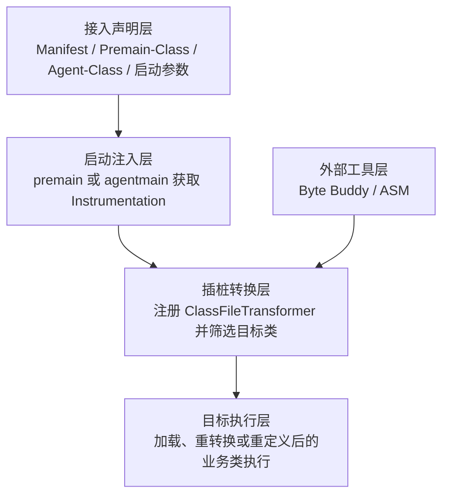
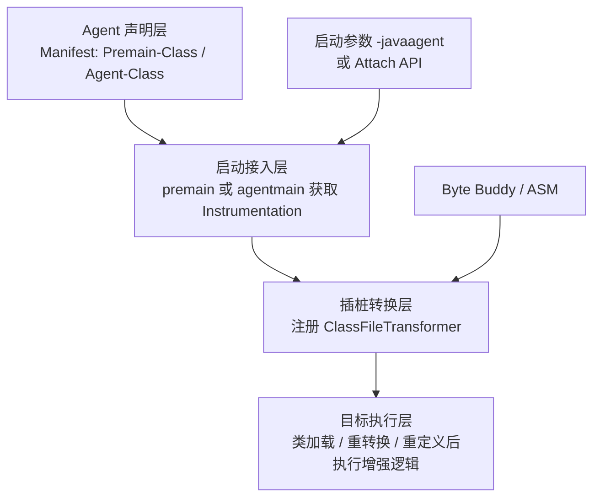
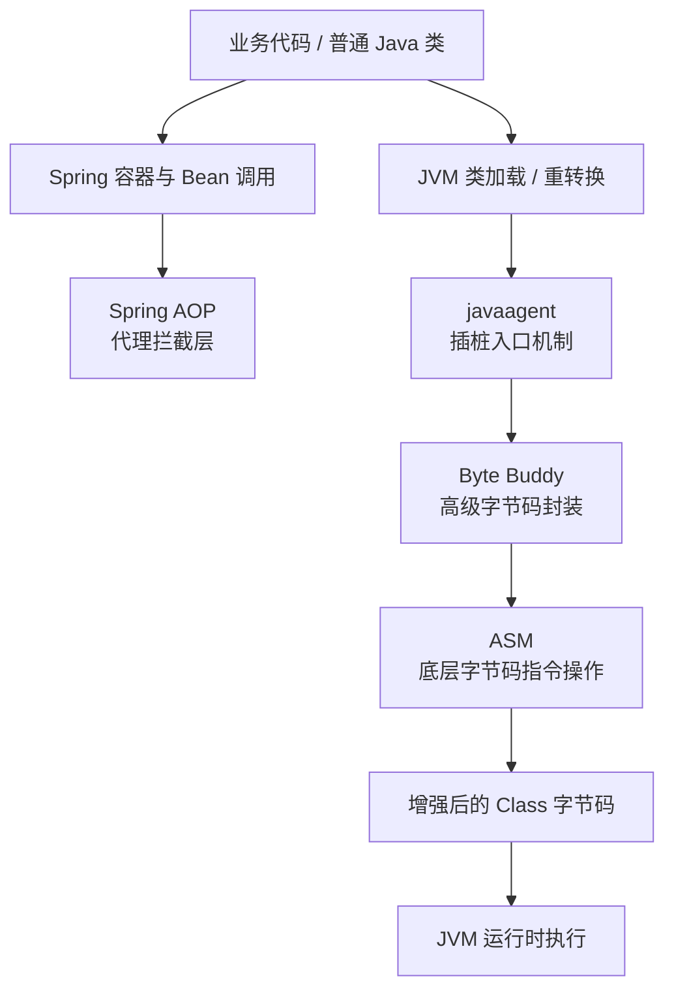

# 技术探索研究：javaagent

**成文时间**: 2026-04-17 16:03
**对比技术**: Spring AOP, Byte Buddy, ASM

---

## 摘要

`javaagent` 是 JVM 基于 `java.lang.instrument` 提供的运行时插桩机制。它允许开发者在 JVM 启动时或进程运行中，把代理逻辑注入到类加载与重转换链路中，以修改方法字节码、补充监控逻辑或增强运行行为。与 Spring AOP 这类应用层代理方案相比，`javaagent` 作用在 JVM 类定义阶段，覆盖范围更广，也更适合 APM、诊断探针和无侵入埋点。

## 1. 研究范围与证据基础

本报告综合使用 5 个可信来源，覆盖官方 API 文档、官方参考文档、官方项目主页与官方仓库，可信级别涉及 A、B。

## 2. 研究对象与基础资料

**官方文档**: [https://docs.oracle.com/en/java/javase/24/docs/api/java.instrument/java/lang/instrument/package-summary.html](https://docs.oracle.com/en/java/javase/24/docs/api/java.instrument/java/lang/instrument/package-summary.html)

**运行时附加接口**: [https://docs.oracle.com/en/java/javase/22/docs/api/jdk.attach/com/sun/tools/attach/package-summary.html](https://docs.oracle.com/en/java/javase/22/docs/api/jdk.attach/com/sun/tools/attach/package-summary.html)

---

## 3. 可信来源汇总

| 来源 | 类型 | 可信级别 | 主要贡献 |
|------|------|----------|----------|
| Oracle `java.lang.instrument` | 官方文档 | A | 定义 agent 生命周期、入口方法、manifest 属性与能力边界 |
| Oracle `jdk.attach` / `com.sun.tools.attach` | 官方文档 | A | 说明运行时 attach 与动态加载 agent 的标准接口 |
| Spring Framework AOP Reference | 官方文档 | A | 校正 Spring AOP 的代理模型与适用边界 |
| Byte Buddy 官方仓库 | 官方仓库 | B | 补充主流 agent 工程实现方式与高层字节码封装思路 |
| ASM 官方主页 | 官方项目主页 | B | 补充底层字节码变换框架定位与典型应用 |

### 3.1 交叉验证说明

- Oracle 官方文档用于抽取 `javaagent` 的定义、入口、能力约束与运行边界。
- Spring 官方文档用于校正“代理式 AOP”与“JVM 插桩”之间的技术分层差异。
- Byte Buddy 与 ASM 官方资料用于说明 `javaagent` 机制之上的常见实现工具链。

---

## 4. 语义标签归纳

以下 Tag 基于当前知识库语义做近似归纳，主要用于帮助定位其技术角色，而不是把 `javaagent` 错认成 AI Agent。

| Tag | 说明 |
|-----|------|
| 自动化 | 自动完成监控、埋点、增强与探测逻辑 |
| 执行 | 直接影响 JVM 中目标类的执行路径 |
| CLI | 常通过 `-javaagent` 启动参数接入 |
| 验证 | 常用于诊断、探针、观测与问题验证 |

---

## 5. 技术架构分析

### 5.1 架构视角

- 架构类型：JVM 运行时驱动逻辑分层
- 逻辑分层：接入声明层 -> 启动注入层 -> 插桩转换层 -> 目标执行层
- 物理落位：启动参数 / Attach API -> Agent JAR -> `Instrumentation` -> `ClassFileTransformer` -> 目标类
- 核心控制点：类加载、重转换与字节码变换入口
- 集成边界：JVM、类加载器、目标应用、字节码库
- 架构说明：`javaagent` 提供的是“何时插桩”的官方入口，不直接规定“如何改字节码”的具体语法

### 5.2 架构图

### 5.3 逻辑分层明细

| 层级 | 分层名称 | 主要职责 |
|------|----------|----------|
| 1 | 接入声明层 | 通过 manifest 与启动参数声明 agent 入口与能力诉求 |
| 2 | 启动注入层 | 在 JVM 启动前或运行中获取 `Instrumentation` |
| 3 | 插桩转换层 | 注册 transformer，决定哪些类被增强以及如何增强 |
| 4 | 目标执行层 | 让增强后的 class 在 JVM 中继续执行 |

---

## 6. 工作原理概述

### 6.1 生命周期入口

`javaagent` 有两条主入口：

- `premain`：通过 `-javaagent:<jar>` 在应用 `main` 前启动
- `agentmain`：通过 attach 方式在运行中的 JVM 中动态加载

对应关系是：

- 启动前增强更适合统一注入、APM、框架探针
- 运行时增强更适合诊断、临时排障、热插探针

### 6.2 核心执行链

`javaagent` 的标准执行链可概括为：

1. JVM 读取 agent JAR 的 manifest
2. 调用 `premain` 或 `agentmain`
3. agent 获取 `Instrumentation`
4. 注册 `ClassFileTransformer`
5. JVM 在类加载、重转换或重定义时回调 transformer
6. transformer 返回原字节码或增强后的字节码
7. JVM 按最终字节码定义或替换目标类

### 6.3 关键接口与边界

| 接口 / 机制 | 作用 |
|------|------|
| `Instrumentation` | 提供注册 transformer、重转换、重定义、查询已加载类等能力 |
| `ClassFileTransformer` | 负责接收 class 字节码并决定是否修改 |
| `Premain-Class` | 启动时 agent 入口声明 |
| `Agent-Class` | 运行时动态加载 agent 的入口声明 |
| `Can-Redefine-Classes` / `Can-Retransform-Classes` | 声明是否需要类重定义与重转换能力 |

### 6.4 一句话理解

`javaagent` 本质上是 JVM 给出的“类进入运行前后，你能否拦截并改写它”的官方插口。

---

## 7. 对比分析

### 7.1 对比对象定位

本节重点对比 `Spring AOP`，并补充 `Byte Buddy`、`ASM` 以澄清它们与 `javaagent` 的层级关系。

### 7.2 相同点

| 维度 | javaagent | Spring AOP | Byte Buddy | ASM |
|------|-----------|------------|------------|-----|
| 都能影响方法行为 | 是 | 是 | 是 | 是 |
| 都可用于横切关注点 | 是 | 是 | 是 | 是 |
| 都可支持日志、监控、埋点场景 | 是 | 是 | 是 | 是 |

### 7.3 区别点

| 维度 | javaagent | Spring AOP | Byte Buddy | ASM |
|------|-----------|------------|------------|-----|
| 本质 | JVM 插桩机制 | Spring 代理式 AOP | 高层字节码工具库 | 底层字节码框架 |
| 作用层 | JVM 类加载层 | Spring Bean 调用层 | 字节码封装层 | 字节码指令层 |
| 是否依赖 Spring | 否 | 是 | 否 | 否 |
| 是否可作用于任意类 | 较强，可覆盖非 Spring 类 | 弱，主要限于 Spring Bean | 取决于接入方式 | 取决于接入方式 |
| 开发复杂度 | 中高 | 低 | 中 | 高 |
| 典型角色 | 机制入口 | 应用层增强方案 | 实现工具 | 底层工具 |

### 7.4 架构对比

| 技术 | 实现逻辑 / 物理分层 | 主要涉及层 | 主要差异标记 |
|------|---------------------|------------|--------------|
| javaagent | 接入声明层 -> 启动注入层 -> 插桩转换层 -> 目标执行层 | JVM 类加载与字节码变换入口 | 基准：运行时插桩主导 |
| Spring AOP | Bean 创建 -> 代理生成 -> 方法拦截 -> Advice 执行 | Spring 容器与代理调用链 | 本技术偏“代理拦截主导”，不是 JVM 全局插桩 |
| Byte Buddy | DSL 定义 -> 类型匹配 -> 拦截器组装 -> 字节码生成 | 高层字节码封装与 agent 常用实现 | 本技术偏“实现工具主导”，不是独立入口机制 |
| ASM | class 结构遍历 -> 指令级访问 -> 栈帧处理 -> 输出新字节码 | 指令级改写与分析 | 本技术偏“底层控制主导”，复杂度最高 |

### 7.5 四平面对比矩阵

| 技术 | 控制面 | 数据面 | 执行面 | 治理面 |
|------|--------|--------|--------|--------|
| javaagent | `Instrumentation`、transformer 注册与类重转换控制 | class 字节数组、类元信息、类加载上下文 | JVM 类加载链与目标方法执行路径 | 适合接入观测、诊断、探针与运行时治理 |
| Spring AOP | Spring 容器中的切面配置、pointcut 与 advice 规则 | Bean 定义、代理对象与上下文 | 方法调用经代理链执行 | 适合业务层规则治理，不擅长 JVM 级观测 |
| Byte Buddy | `AgentBuilder`、类型匹配、拦截规则 DSL | 类型描述、方法签名、增强规则 | 生成并返回增强后的字节码 | 工程友好，适合沉淀稳定的 agent 实现 |
| ASM | 访问器模型、class tree、opcode 控制 | 常量池、方法表、指令与帧信息 | 指令级写入与 class 重新生成 | 灵活但维护成本高，适合底层框架作者 |

### 7.6 差异讨论

- 相较于 `Spring AOP`，`javaagent` 不依赖 Spring 容器，也不局限于代理对象，因此更适合 APM、JDBC/RPC 自动探针、线上诊断与全局埋点。
- 相较于 `javaagent`，`Spring AOP` 更贴近业务开发，配置简单、风险更小，更适合事务、权限、审计、日志等应用层横切逻辑。
- `Byte Buddy` 与 `ASM` 不是 `javaagent` 的竞争替代物，而是其常见实现工具；它们回答的是“如何改字节码”，不是“何时接入 JVM”。
- 工程实践里更常见的组合是 `javaagent + Byte Buddy`，而不是直接 `javaagent + ASM`。

### 7.7 选型建议

| 场景 | 推荐技术 | 理由 |
|------|----------|------|
| 事务、权限、业务日志 | Spring AOP | 足够简单，直接贴近 Bean 调用链 |
| APM、自动埋点、全局监控 | javaagent | 可无侵入覆盖更广的目标类 |
| 自研稳定探针 | javaagent + Byte Buddy | 兼顾能力与可维护性 |
| 指令级优化或框架底层开发 | javaagent + ASM | 需要极致控制时才值得使用 |

---

## 8. 常用实现模式

### 模式 1: 启动时统一探针

- 通过 `-javaagent` 启动应用
- 在 `premain` 中注册 transformer
- 按包名、注解或方法签名筛选目标类
- 在方法前后织入计时、埋点或上下文逻辑

### 模式 2: 运行时诊断探针

- 使用 Attach API 连接目标 JVM
- 动态加载 agent JAR
- 针对指定类触发 retransformation
- 观察方法耗时、异常、参数或线程状态

### 模式 3: 高层工具封装

- 使用 Byte Buddy 负责类型匹配与拦截规则
- 使用 `javaagent` 负责接入 JVM 生命周期
- 把底层 ASM 复杂度隐藏在工具层之下

---

## 9. 风险与边界

- 插桩范围过大可能带来明显性能损耗
- 类加载器、模块系统与 bootstrap 路径是高频兼容性问题
- 运行时动态加载在新 JDK 上有更严格的告警与治理要求
- `javaagent` 适合基础设施增强，不适合替代正常的业务设计与架构分层

---

## 10. 参考资料

- [Oracle: `java.lang.instrument`](https://docs.oracle.com/en/java/javase/24/docs/api/java.instrument/java/lang/instrument/package-summary.html)
- [Oracle: `jdk.attach` / `com.sun.tools.attach`](https://docs.oracle.com/en/java/javase/22/docs/api/jdk.attach/com/sun/tools/attach/package-summary.html)
- [Spring Framework AOP Reference](https://docs.spring.io/spring-framework/reference/6.2.17/core/aop/proxying.html)
- [Byte Buddy GitHub](https://github.com/raphw/byte-buddy/)
- [ASM 官方主页](https://asm.ow2.org/)
# 技术探索研究：javaagent

**成文时间**: 2026-04-17 16:03
**对比技术**: Spring AOP, Byte Buddy, ASM

---

## 摘要

`javaagent` 是 JVM 提供的官方插桩机制，核心基于 `java.lang.instrument`。它允许在 JVM 启动阶段或运行阶段把代理 JAR 注入目标进程，通过 `Instrumentation` 与 `ClassFileTransformer` 在类加载、重转换、重定义时修改字节码。与 `Spring AOP` 这类应用层代理方案不同，`javaagent` 工作在 JVM 类加载链路，更适合无侵入监控、链路追踪、诊断探针与基础设施增强；而 `Byte Buddy` 与 `ASM` 则分别属于实现 `javaagent` 时常用的高层、底层字节码工具。

## 1. 研究范围与证据基础

本报告综合使用 5 个可信来源，覆盖 Java 官方文档、JDK 官方 API、Spring 官方文档、ASM 官方站点与 Byte Buddy 官方仓库，重点回答三个问题：

1. `javaagent` 的工作原理是什么
2. 它与 `Spring AOP` 的边界差异在哪里
3. 它与 `Byte Buddy`、`ASM` 分别是什么关系

---

## 2. 研究对象与基础资料

**官方文档**: [java.lang.instrument](https://docs.oracle.com/en/java/javase/24/docs/api/java.instrument/java/lang/instrument/package-summary.html)

**相关运行时机制**: [jdk.attach / com.sun.tools.attach](https://docs.oracle.com/en/java/javase/22/docs/api/jdk.attach/com/sun/tools/attach/package-summary.html)

---

## 3. 可信来源汇总

| 来源 | 类型 | 可信级别 | 主要贡献 |
|------|------|----------|----------|
| Oracle `java.lang.instrument` | 官方文档 | A | 定义 `javaagent`、入口方法、Manifest 属性与插桩边界 |
| Oracle `jdk.attach` | 官方文档 | A | 说明运行中 JVM 的 attach 与动态加载路径 |
| Spring Framework AOP Reference | 官方文档 | A | 说明 Spring AOP 是 proxy-based，并明确其限制 |
| ASM 官方站点 | 官方文档 | A | 说明 ASM 是通用字节码分析与修改框架 |
| Byte Buddy 官方仓库 | 官方仓库 | B | 说明 Byte Buddy 的 agent 能力与工程化实践入口 |

### 3.1 交叉验证说明

- Java 官方文档用于校准 `premain`、`agentmain`、`Instrumentation` 与 `ClassFileTransformer` 的语义。
- Spring 官方文档用于确认其本质是代理式 AOP，而非 JVM 级插桩。
- ASM 与 Byte Buddy 官方资料用于澄清二者是“实现工具”，不是 `javaagent` 本身。

---

## 4. 语义标签归纳

| Tag | 说明 |
|-----|------|
| JVM | Java 虚拟机运行时 |
| 字节码 | 直接作用于 class 字节码 |
| 插桩 | 在加载或执行前后植入增强逻辑 |
| 运行时增强 | 在运行期改变类行为 |
| 无侵入监控 | 不修改业务源码完成观测 |
| 诊断探针 | 排障、审计、跟踪、性能采样 |
| AOP | 横切增强，但实现层级不同 |
| 类加载 | 依赖 JVM 类定义与重转换机制 |

---

## 5. 技术架构分析

### 5.1 架构视角

- 架构类型：JVM 类加载驱动逻辑分层
- 逻辑分层：Agent 声明层 -> 启动接入层 -> 插桩转换层 -> 目标执行层
- 物理落位：启动参数 / Attach 工具 -> Agent JAR -> JVM Instrumentation -> Transformer -> 目标类
- 核心控制点：类加载时机、目标类过滤、字节码转换规则
- 集成边界：JVM、目标类加载器、字节码工具库、观测/治理系统
- 架构说明：`javaagent` 负责“何时插桩、如何接入 JVM”，不直接规定“用什么语法改字节码”

### 5.2 架构图

### 5.3 逻辑分层明细

| 层级 | 分层名称 | 主要职责 |
|------|----------|----------|
| 1 | Agent 声明层 | 通过 JAR Manifest 声明入口类、能力标记与类路径附加信息 |
| 2 | 启动接入层 | 通过 `premain` 或 `agentmain` 获取 `Instrumentation` |
| 3 | 插桩转换层 | 注册 `ClassFileTransformer`，筛选目标类并返回修改后字节码 |
| 4 | 目标执行层 | 让增强后的类进入 JVM 执行，并承接监控、埋点、诊断逻辑 |

### 5.4 工作原理概述

`javaagent` 的运行主线可以压缩为：

1. JVM 通过 `-javaagent` 或动态 attach 加载 agent JAR
2. 调用 `premain` 或 `agentmain`
3. agent 拿到 `Instrumentation`
4. agent 注册 `ClassFileTransformer`
5. JVM 在类加载、重转换、重定义时把原始字节码交给 transformer
6. transformer 返回修改后的字节码
7. JVM 用新字节码定义或替换目标类

### 5.5 关键机制

| 机制 | 说明 | 关键点 |
|------|------|--------|
| `premain` | JVM 启动期入口 | 在业务 `main` 前执行，失败可能直接阻止应用启动 |
| `agentmain` | 运行时入口 | 常与 attach 配合，用于在线注入探针 |
| `Instrumentation` | JVM 暴露的插桩接口 | 可注册 transformer、重定义类、重转换类 |
| `ClassFileTransformer` | 字节码转换回调点 | 接收原始字节码并输出增强后字节码 |
| `Can-Redefine-Classes` / `Can-Retransform-Classes` | Agent 能力声明 | 决定能否修改已加载类 |

---

## 6. 对比分析

### 6.1 对比结论先行

- `Spring AOP` 是应用层代理方案，核心是“代理对象拦截方法调用”
- `javaagent` 是 JVM 层插桩机制，核心是“类进入运行前后改字节码”
- `Byte Buddy` 是高层字节码工具，常用于更容易地实现 `javaagent`
- `ASM` 是底层字节码工具，提供最细粒度控制

### 6.2 技术分层关系图

### 6.3 统一分层覆盖矩阵

| 统一分层 | Spring AOP | javaagent | Byte Buddy | ASM |
|------|------|------|------|------|
| 应用对象层 | 强 / Spring Bean 代理 | 弱 / 非主要关注点 | 弱 / 只是实现手段 | 弱 / 只是实现手段 |
| JVM 类加载层 | 弱 / 不直接控制 | 强 / 入口机制与生命周期主导 | 中 / 配合 agent 落地 | 中 / 可配合 agent 落地 |
| 字节码转换层 | 弱 / 主要靠代理而非改 class | 中 / 定义插桩时机与回调接口 | 强 / 工程友好地描述转换逻辑 | 强 / 直接编辑 class 结构与指令 |
| 运行时治理层 | 中 / 事务、日志等业务治理 | 强 / 监控、诊断、探针、全局增强 | 中 / 便于工程落地 | 弱 / 偏底层能力，不直接提供治理语义 |

### 6.4 分层与控制点对比

| 技术 | 实现逻辑 / 物理分层 | 主要涉及层 | 主要差异标记 |
|------|---------------------|------------|--------------|
| Spring AOP | 代理创建 -> 切点匹配 -> Advice 执行 -> 目标方法调用 | 应用对象层 | 基准：代理拦截主导 |
| javaagent | Agent 加载 -> Instrumentation -> Transformer -> JVM 类定义 | JVM 类加载层、字节码转换层 | 本技术偏「JVM 插桩主导」，不依赖 Spring 容器 |
| Byte Buddy | 规则声明 -> 拦截绑定 -> 生成或修改字节码 -> 输出 Class | 字节码转换层 | 本技术偏「高级封装主导」，常作为 `javaagent` 的实现工具 |
| ASM | ClassReader -> Visitor 链 -> 指令级改写 -> ClassWriter | 字节码转换层 | 本技术偏「底层指令主导」，灵活度最高、复杂度也最高 |

### 6.5 四平面对比矩阵

| 技术 | 控制面 | 数据面 | 执行面 | 治理面 |
|------|--------|--------|--------|--------|
| Spring AOP | 切点表达式与代理策略 | Spring Bean、方法参数、返回值 | Advice 包裹目标方法调用 | 事务、权限、日志等业务横切 |
| javaagent | 类加载时机、Transformer 注册、重转换策略 | class 字节码、类加载器、模块信息 | JVM 回调 transformer 并定义增强后类 | 监控、跟踪、审计、诊断、探针治理 |
| Byte Buddy | 拦截规则、匹配器、转换 DSL | 类型描述、方法签名、注解元数据 | 生成或改写字节码 | 通过更低门槛支撑 agent 工程实现 |
| ASM | Visitor 链、指令级访问控制 | class 结构、常量池、方法体指令 | 指令级改写与重写输出 | 本身不直接定义治理语义 |

### 6.6 重点差异讨论

#### 6.6.1 `javaagent` vs `Spring AOP`

这是最容易混淆的一组。

- `Spring AOP` 是 **proxy-based**
- `javaagent` 是 **instrumentation-based**

前者拦截的是“代理对象上的方法调用”，后者拦截的是“JVM 定义类的过程”。因此：

| 对比点 | Spring AOP | javaagent |
|------|------------|-----------|
| 是否依赖 Spring 容器 | 是 | 否 |
| 是否要求目标对象是 Bean | 是 | 否 |
| 是否能覆盖非 Spring 管理类 | 很弱 | 很强 |
| 是否能在类加载阶段增强 | 否 | 是 |
| 对 `final/private` 等限制 | 明显 | 取决于字节码改写策略 |
| 典型用途 | 事务、权限、日志切面 | APM、探针、诊断、无侵入埋点 |

结论是：如果问题发生在“业务框架层”，优先考虑 `Spring AOP`；如果目标是“全 JVM 范围无侵入增强”，才应进入 `javaagent` 方案空间。

#### 6.6.2 `javaagent` vs `Byte Buddy`

这组不是竞争关系，而是“机制”和“工具”的关系。

- `javaagent` 决定你如何接入 JVM
- `Byte Buddy` 决定你如何更舒服地写转换逻辑

工程上常见组合是：`javaagent + Byte Buddy`

#### 6.6.3 `javaagent` vs `ASM`

这组也不是同层竞争。

- `javaagent` 提供插桩入口
- `ASM` 提供底层字节码编辑能力

若直接用 `ASM` 写 agent，灵活度最高，但代码复杂度、维护成本和出错概率都会明显上升。

### 6.7 适用场景

| 场景 | 推荐技术 | 理由 |
|------|----------|------|
| 给 Spring 业务方法加事务、权限、日志 | Spring AOP | 业务层横切即可，成本最低 |
| 不改业务代码做全链路监控 | javaagent | 能覆盖 JVM 中更广泛的类与框架 |
| 自研探针并追求开发效率 | javaagent + Byte Buddy | 兼顾 JVM 接入能力与工程友好性 |
| 需要极细粒度控制字节码结构 | javaagent + ASM | 适合底层框架、编译器、极致定制场景 |

### 6.8 选型判断

- 只要需求停留在“Bean 方法增强”，不要急着上 `javaagent`
- 一旦目标变成“全局无侵入监控 / 运行时探针 / 线上诊断”，`javaagent` 才真正有必要
- 真正写 agent 时，优先考虑 `Byte Buddy`，除非明确需要 `ASM` 级别控制

---

## 7. 常用实现模式

### 模式 1：启动期预置探针

通过 `-javaagent:agent.jar` 在 JVM 启动时注入探针，适合 APM、统一监控、全局埋点。

### 模式 2：运行时动态注入

通过 attach API 把 agent 打进正在运行的 JVM，适合线上排障、临时诊断、动态观测。

### 模式 3：高层 DSL 插桩

使用 `Byte Buddy` 以规则化方式匹配类和方法，避免直接操作字节码指令。

### 模式 4：底层字节码改写

使用 `ASM` 直接访问 class 结构、方法体和指令流，适合高性能、深度定制或框架级增强。

---

## 8. 风险与边界

- 类加载器、模块系统、Bootstrap 路径是常见复杂点
- 插桩范围过大可能带来明显性能损耗
- 动态 attach 在新 JDK 环境下限制和告警更严格
- 错误的字节码改写可能直接影响类加载稳定性
- `javaagent` 适合基础设施增强，不适合替代正常的业务建模与架构设计

---

## 9. 参考资料

- [Oracle: java.lang.instrument](https://docs.oracle.com/en/java/javase/24/docs/api/java.instrument/java/lang/instrument/package-summary.html)
- [Oracle: jdk.attach / com.sun.tools.attach](https://docs.oracle.com/en/java/javase/22/docs/api/jdk.attach/com/sun/tools/attach/package-summary.html)
- [Spring Framework: AOP Proxies](https://docs.spring.io/spring-framework/reference/7.1-SNAPSHOT/core/aop/introduction-proxies.html)
- [Spring Framework: Proxying Mechanisms](https://docs.spring.io/spring-framework/reference/6.2.17/core/aop/proxying.html)
- [ASM 官方站点](https://asm.ow2.org/)
- [Byte Buddy 官方仓库](https://github.com/raphw/byte-buddy)
